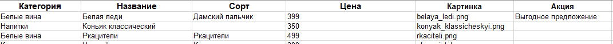

# Магазин элитных вин

## Описание проекта

Этот проект представляет собой скрипт для создания верстки интернет-магазина элитного вина. Скрипт генерирует файл index.html, в который подставляются данные о различных винных изделиях с использованием шаблона из template.html.

## Структура проекта

- main.py: основной файл, который содержит функцию main, создающую index.html и две вспомогательные функции.

- template.html: шаблон верстки, куда подставляются данные о винах.

- .env: файл для указания пути к файлу с данными о винах.

## Вспомогательные функции

1. get_years_with_correct_declension: функция, подсчитывающая возраст магазина с даты его создания. Дата создания хранится в переменной FOUNDING_DATE.

2. get_fill_wines_data: основная функция для получения коллекции вин из файла xlsx. Путь до этого файла должен быть указан пользователем в файле .env. Также здесь используется переменная со списком категорий, для которых не требуется указывать описание сорта вина (DISABLED_SORT).
В столбце `Акция` `.xlsx` файла указывается информация об акции. Если этот столбец не пустой, на товаре выводится картинка, подтверждающая наличие акции.

## Описание столбцов xlsx файла

В файле xlsx используются следующие столбцы:

- Категория: категория, к которой относится вино.
- Название: полное название вина.
- Сорт: сорт винограда, из которого изготовлено вино.
- Цена: цена за бутылку.
- Картинка: ссылка на изображение бутылки. Предполагается, что изображения должны хранится в файле images в корне проекта.
- Акция: информация об акции. Если столбец не пустой, на товаре выводится картинка, подтверждающая наличие акции.
- Пример заполненых данных:


## Зависимости

Для работы с версткой используется библиотека:

- Jinja2==3.1.4

Для работы с переменными окружения:

- python-dotenv==1.0.1

## Установка

Для установки всех необходимых пакетов используйте команду:

```
pip install -r requirements.txt
```

## Запуск программы

1. Перейдите в папку проекта.

2. Убедитесь, что в файле .env добавлена переменная среды WINES_FILE с путем до файла с данными о винах.

3. Запустите скрипт:

```
python main.py
```

После выполнения этих шагов в корневом каталоге проекта будет создан файл index.html с готовой версткой магазина элитного вина.
